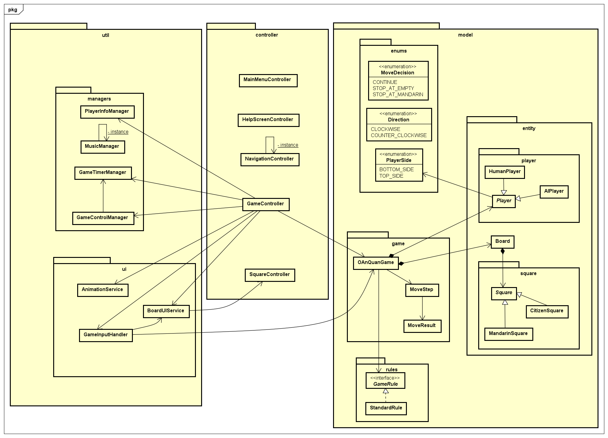
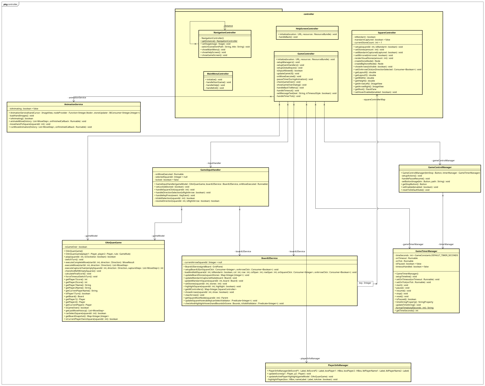
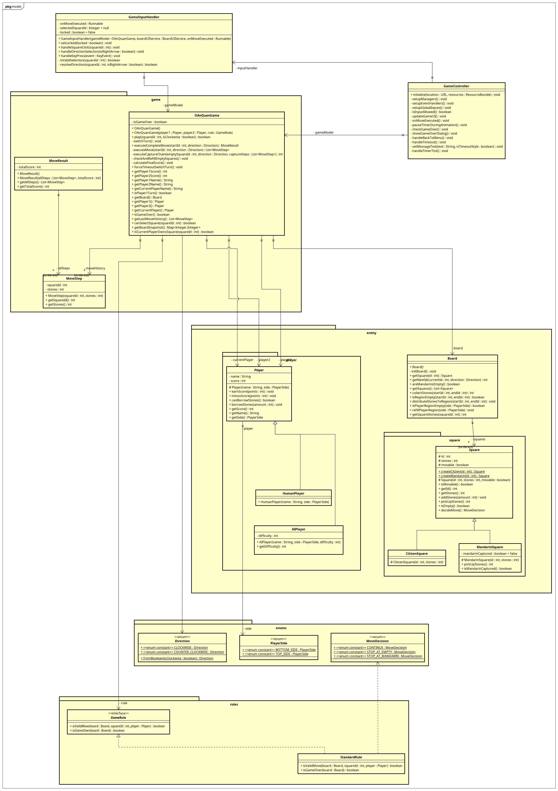
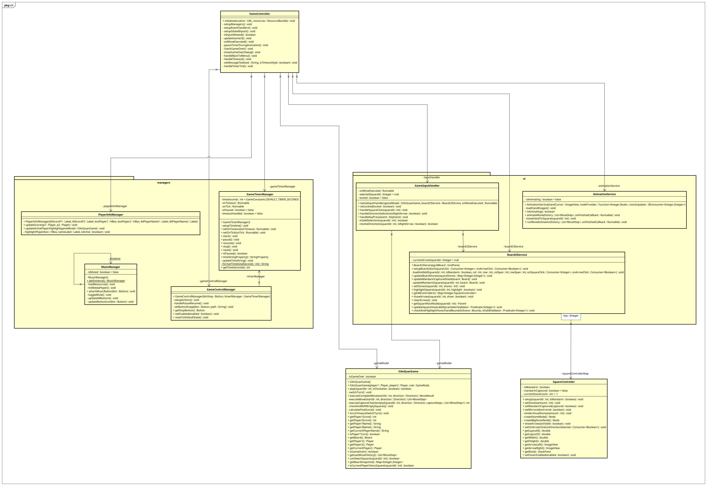

# Object-Oriented Programming Mini-Project Report

**Project title:** Traditional Game – Ô ăn quan  
**Topic:** Topic 4 — Traditional game: Ô ăn quan  

---

## 1. Assignment of Members

## 2. Team Members & Assignment

| Name | Student ID | Coding Responsibility | Contribution |
|------|------------|----------------------|--------------|
| Vũ Đức Tâm | 20230064 | Game engine, turn flow, end-game logic | 25% |
| Nguyễn Tuấn Long | 202416269 | Board and square structure, stone distribution | 25% |
| Nguyễn Đăng Cao Tuấn | 202400119 | Player classes, scoring, move validation | 25% |
| Nguyễn Gia Khánh | 202416803 | GUI controllers, event handling, screen navigation | 25% |

---

## 2. Mini-Project Description

### 2.1 Objective

This project implements the traditional Vietnamese board game **Ô ăn quan** as an interactive desktop application using Java and JavaFX. The goal is to apply Object-Oriented Programming principles such as encapsulation, inheritance, abstraction, and polymorphism to model the game board, players, squares, rules, and gameplay mechanics.

### 2.2 Functional Requirements

- Display the game board with 10 citizen squares and 2 mandarin squares.
- Allow two players to take turns selecting a square and a direction.
- Implement stone spreading and capturing rules correctly.
- Update player scores dynamically.
- End the game when both mandarin squares are empty.
- Announce the winner when the game ends.
- Provide a main menu, help screen, and game screen.

### 2.3 Non-Functional Requirements

- Clear separation between logic and UI.
- Extensible design for adding new rules or AI players.
- No use of pre-built game engines.

---

## 3. Use Case Diagram and Explanation

### 3.1 Actor(s) & Use Cases

| Use Case          | Actor  | Description                                                                                 |
| ----------------- | ------ | ------------------------------------------------------------------------------------------- |
| Start Game        | Player | Starts a new Ô ăn quan game session and initializes the board and players.                  |
| View Help / Rules | Player | Displays the instructions and rules of the Ô ăn quan game.                                  |
| Exit Application  | Player | Exits the application after confirmation from the user.                                     |
| Select Square     | Player | Selects a square on the board to pick up and spread stones.                                 |
| Choose Direction  | Player | Chooses the spreading direction (clockwise or counter-clockwise).                           |
| View Board        | Player | Displays the current state of the game board and stones.                                    |
| View Score        | Player | Displays the current scores of both players.                                                |
| End Game          | Player | Ends the current game when the termination condition is reached and shows the final result. |

### 3.2 Explanation

The user interacts with the game via the GUI to select squares and directions. The controller sends these actions to the game engine, which updates the board state and returns the results to the UI for visualization.

---

## 4. Design

### 4.1 General Class Diagram (Package Level)

- `controller` — GUI controllers  
- `model.entity` — core entities  
- `model.game` — game engine  
- `model.rules` — rule implementations  
- `util` — utilities  
- `config` — constants  

---

### 4.2 Detailed Class Diagram

#### 4.2.1 Controller

#### 4.2.2 Model

#### 4.2.3 Util

---

## 5. Detail for Classes / Methods

## 6. Source Usage Declaration
